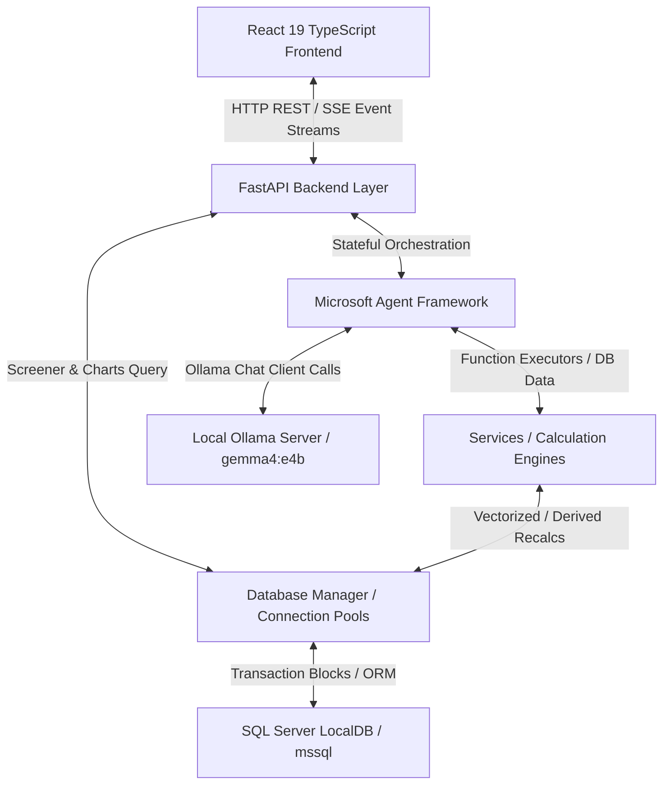
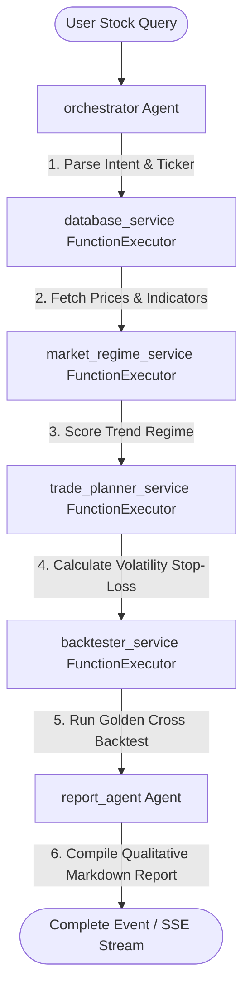
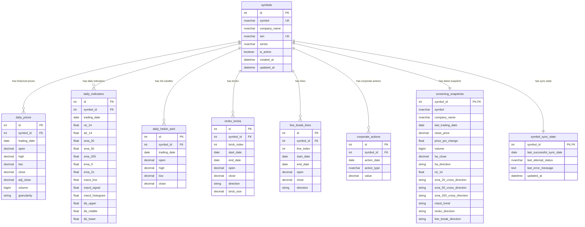
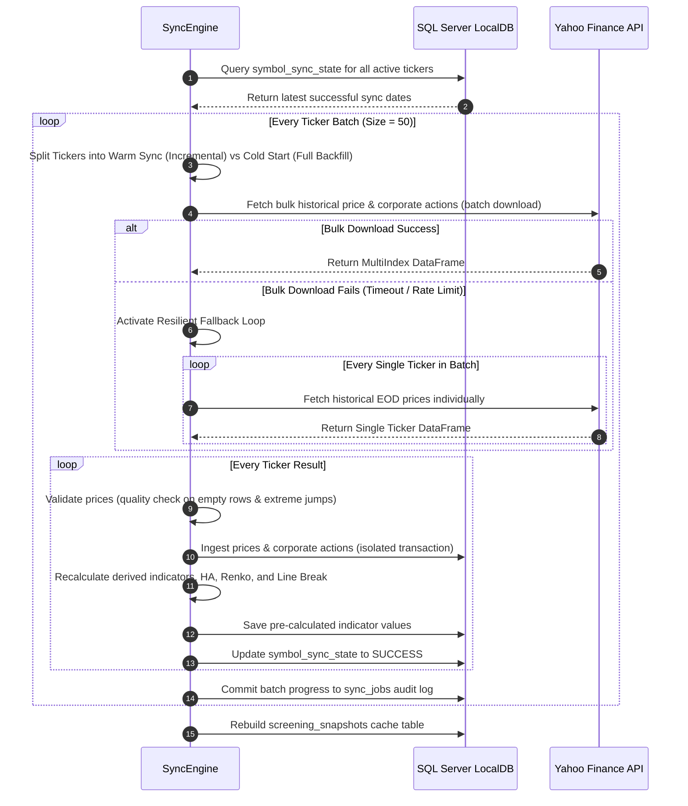
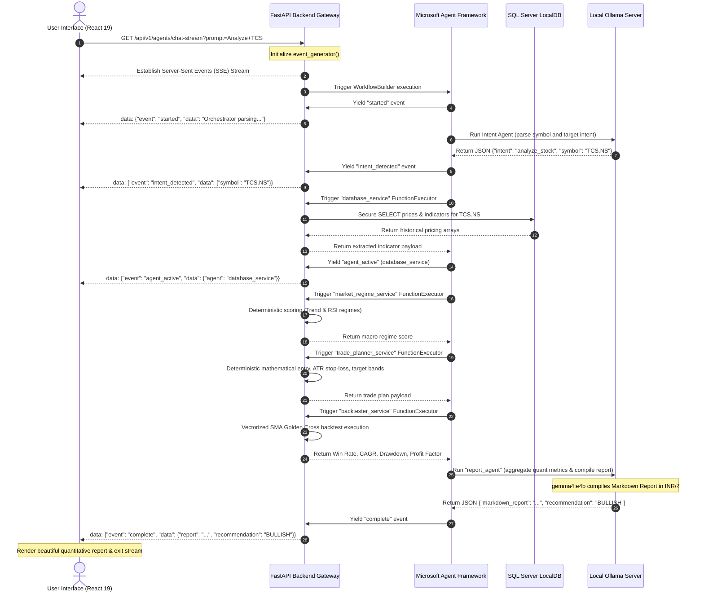

# NSE Technical Analysis, Advanced Charting & Stock Screening Suite

A production-grade, highly resilient, and visually stunning full-stack quantitative stock analysis platform. The suite combines a high-speed **FastAPI Backend** querying **Microsoft SQL Server LocalDB** with a premium **React 19 + TypeScript** terminal UI using **TradingView Lightweight Charts** for advanced market charting, technical screening, and AI-driven technical reporting using the **Microsoft Agent Framework**.

---

## 📋 Table of Contents
1. [Project Overview](#project-overview)
2. [Features](#features)
3. [Architecture Overview](#architecture-overview)
4. [Microsoft Agent Framework Usage](#microsoft-agent-framework-usage)
5. [Database Design](#database-design)
6. [Data Synchronization](#data-synchronization)
7. [Indicator Calculation](#indicator-calculation)
8. [Charting System](#charting-system)
9. [Stock Analysis Workflow](#stock-analysis-workflow)
10. [API Documentation](#api-documentation)
11. [Installation](#installation)
12. [Configuration](#configuration)
13. [Running the Application](#running-the-application)
14. [Manual Operations](#manual-operations)
15. [Deployment](#deployment)
16. [Monitoring and Observability](#monitoring-and-observability)
17. [Troubleshooting](#troubleshooting)
18. [Future Enhancements](#future-enhancements)
19. [Appendix](#appendix)

---

## 🌟 Project Overview

This platform is a comprehensive EOD (End of Day) technical research environment designed for retail traders, quantitative analysts, and financial operations teams focusing on the National Stock Exchange of India (NSE). 

### Business Purpose
* **Automate Quantitative Screenings**: Replaces slow manual charting with high-speed technical parameter sweeps.
* **Resilient Historical Sourcing**: Incremental daily scraping of historical prices and corporate action timelines without overloading external APIs.
* **Deterministic Risk & Execution Planning**: Auto-calculates volatility-adjusted position sizings, entry bands, target brackets, and historical Golden Cross backtest performance.
* **AI Quantitative Reports**: Orchestrates deep qualitative analyses through a Directed Acyclic Graph (DAG) of specialized agents, generating professional-grade PDF/Markdown reports formatted exclusively in Indian Rupees (INR) with the Rupee symbol (`₹`).

### Target Users
* **Active Retail Swing Traders**: Searching for high-probability volume breakouts, RSI divergences, or moving average crossover triggers.
* **Quant Researchers**: Prototyping indicator-based setups with deterministic mathematical execution targets.
* **DevOps & Financial Systems Engineers**: Looking for a stable, self-healing pipeline with automated tasks scheduling and telemetry monitoring.

---

## 🛠️ Features

### 1. Sourcing & Storage Infrastructure
* **Incremental Synchronization**: Automatically detects last successful EOD date per ticker, pulling only the delta `[Last Sync + 1 day, Today]`.
* **Yahoo Finance Resiliency**: Sourced via `yfinance` with rate limiting, HTTP 429 backoff penalties, and individual fallback retry loops for bulk batch downloads.
* **Corporate Actions Timeline**: Direct EOD splits and dividend event scraping, applied sequentially to database indices.

### 2. Analytical Calculations & Market Structure
* **Vectorized Technical Indicators**: Direct mathematical calculation via `pandas-ta` (RSI, ATR, SMA 20/50/200, EMA 9/21, MACD, Bollinger Bands).
* **Heikin-Ashi Candle Generation**: Sequentially calculated trend-following candles with seed-based incremental recalculation hooks.
* **Path-Dependent Renko Bricks**: Asynchronous, volatility-based box charts calculated dynamically using a configurable percentage brick size.
* **Three Line Break Charts**: Multi-line reversal structures calculated sequentially based on high/low price breaks over preceding intervals (defaulting to 3 lines).

### 3. Svelte Visual Terminal Dashboard
* **TradingView Lightweight Charts**: Synchronized multi-pane charting (Price pane, Volume pane, RSI indicators pane) with real-time scrolling and cursor synchronization.
* **Advanced Chart Overlays**: Dynamic toggleable indicator lines directly overlaid on price candles (Moving Averages and Bollinger Bands).
* **Ascending Unique Timestamps**: Safe UTC UNIX timestamp mapping that increments path-dependent brick structures (which can form multiple bricks on the same calendar day) by `+1` second increments. This guarantees unique, strictly ascending timelines, resolving x-axis crashes.
* **Interactive Grid Screener**: Interactive sorting across all parameters, volume breakout multipliers, and single-click CSV exports.

### 4. Dynamic AI Quant Coordination (MAF)
* **Microsoft Agent Framework Integration**: Structured Directed Acyclic Graph (DAG) orchestration executing intent, database query, market structure, trade plan, and qualitative report synthesis.
* **Robust 20-minute Timeout**: Locked Ollama async execution pipelines utilizing custom async timeout clients.
* **Stateful Execution Telemetry**: Automated latency tracking, token usage logging, and direct SSE (Server-Sent Events) live status updates streaming straight to the UI.

---

## 📐 Architecture Overview

The system uses a highly decoupled, data-driven, layered architecture.



### Architectural Layers
1. **Presentation Layer (React 19 + TypeScript)**: Premium dark mode responsive terminal built with Tailwind CSS. It communicates with the backend via standard REST routes and Server-Sent Events (SSE) for streaming qualitative AI reports. Uses Zustand for modular state management and TradingView Lightweight Charts for high-speed hardware-accelerated charting.
2. **Gateway Layer (FastAPI Backend)**: Provides vectorized, compressed endpoints. Implements GZIP compression middleware to handle massive historical EOD arrays over the wire and CORS middleware for development flexibility.
3. **Orchestration Layer (Microsoft Agent Framework)**: Models multi-agent interaction as a stateful Directed Acyclic Graph (DAG). Intent detection, DB querying, macro trend calculations, stop-loss calculations, backtesting, and report compiling are structured as standard `Agent` and `FunctionExecutor` nodes in a dependency tree.
4. **Services & Calculations Layer**: Deterministic mathematical engines (e.g. `IndicatorEngine` using `pandas-ta` and `MarketStructureEngine`) executing high-speed calculations in native Python rather than relying on unstable LLM approximations.
5. **Data Ingestion & Sync Layer (`SyncEngine`)**: Controls incremental downloading, rate-limiting, quality validations, and safe batch commits.
6. **Persistence Layer (SQL Server LocalDB)**: Maintained via SQLAlchemy 2.0 ORM mappings and Alembic schema migrations. Uses database indexing to support sub-5ms screening sweeps.

---

## 🤖 Microsoft Agent Framework Usage

The quantitative analysis workflow has been fully migrated to use the official **Microsoft Agent Framework (MAF)** as its core orchestration backend. Custom sequential loops have been replaced with a stateful Directed Acyclic Graph (DAG) consisting of standard `Agent` and `FunctionExecutor` nodes.

### Registered Agents

Specialized LLM agents are defined via JSON configurations in `config/agents/` and instantiated with strict system instructions and compatible structured outputs.

| Agent Name | Agent Role | Config File | Base Model | Provider | Primary Responsibilities & Currency Enforcements |
| :--- | :--- | :--- | :--- | :--- | :--- |
| **orchestrator** | AI Quant Coordinator | `orchestrator.json` | `gemma4:e4b` | Ollama | Parses natural language user queries. Identifies ticker symbols and maps requests to active workflows (`analyze_stock`, `breakout_scan`, etc.). |
| **report_agent** | Chief Investment Reporter | `report_agent.json` | `gemma4:e4b` | Ollama | Aggregates all pre-calculated indicators, ATR stop-losses, and historical Golden Cross backtest metrics. Compiles the final professional Qualitative Investment Report. **Strictly enforces INR/₹ pricing notation.** |
| **stock_analysis_agent** | Quantitative Research Analyst | `stock_analysis_agent.json` | `gemma4:e4b` | Ollama | Evaluates raw OHLCV price histories, Heikin-Ashi trends, Renko brick patterns, and Three Line Break reversals to calculate quantitative scores (Trend, Momentum, Risk, Confidence). **Strictly enforces INR/₹ pricing notation.** |
| **trade_planner_agent** | Risk Management & Execution Planner | `trade_planner_agent.json` | `gemma4:e4b` | Ollama | Auto-generates entry bands, ATR volatility stop-losses, and target tiers. Formulates tactical trade sizing under standard account risk guidelines. **Strictly enforces INR/₹ pricing notation.** |
| **market_regime_agent** | Macro Market Strategist | `market_regime_agent.json` | `gemma4:e4b` | Ollama | Determines broad market regime categories (Bullish, Bearish, Sideways, Compressed, Volatile) and outputs macro strategic rationales. |
| **opportunity_scanner_agent** | Quant Screening Specialist | `opportunity_scanner_agent.json` | `gemma4:e4b` | Ollama | Checks indicators and screening snapshots to find high-probability breakout, reversal, or mean-reversion setups. |
| **sql_data_agent** | Quantitative Database Specialist | `sql_data_agent.json` | `gemma4:e4b` | Ollama | Generates highly secure, read-only SQL SELECT queries to parse relational data safely without risk of write-injections. |

---

### Workflows

Dynamic pipelines are designed using MAF `WorkflowBuilder`. The primary entry-point workflow is **`analyze_stock`**:



#### Step-by-Step Execution Lifecycle
1. **User Query Trigger**: User requests an analysis (e.g. *"Analyze Reliance Industries"*).
2. **Intent Parsing (`orchestrator`)**: Directs query to `orchestrator` agent. Using structured JSON formatting, it identifies `"intent": "analyze_stock"`, standardizes `"symbol": "RELIANCE.NS"`, and provides the `"rationale"`.
3. **Database Retrieval (`database_service` Executor)**: Standard `FunctionExecutor` node. Queries SQL Server LocalDB for historical pricing and daily indicators. Secures query inputs by standardizing uppercase symbols and enforcing alphanumeric patterns to block SQL injection attempts.
4. **Regime Scoring (`market_regime_service` Executor)**: Standard `FunctionExecutor` node. Performs deterministic calculations on closing prices and 200 SMAs to score the macro regime (Bullish/Bearish).
5. **Volatility Bands Planning (`trade_planner_service` Executor)**: Standard `FunctionExecutor` node. Computes volatility stop-losses and target tiers mathematically.
6. **Strategy Performance (`backtester_service` Executor)**: Standard `FunctionExecutor` node. Executes a Golden Cross backtest using historical price and indicator series, calculating Win Rate, CAGR, Sharpe Ratio, Profit Factor, and Max Drawdown.
7. **Report Compilation (`report_agent`)**: Directs the aggregated quantitative metrics to the `report_agent`. It generates a publication-ready report in Markdown format, returning the qualitative analysis, an executive recommendation (BULLISH/BEARISH/NEUTRAL/AVOID), and a confidence score.

---

### Tools & Functions available to Agents

The backend exposes deterministic mathematical functions and database services to the MAF DAG nodes:
* `DatabaseService.get_prices_for_window`: Fetches chronological EOD price histories.
* `DatabaseService.get_sync_state`: Determines symbol synchronization status.
* `TradePlannerService.calculate_trade_plan`: Deterministically generates volatility stops, entries, and target channels.
* `BacktestingService.execute_strategy_backtest`: Vectorized historical simulation engine for SMA crossovers.
* `ScreeningService.query_screener`: Performs high-speed database sweeps against snapshotted records.

---

## 💾 Database Design

The persistence layer runs on **Microsoft SQL Server LocalDB** using SQLAlchemy 2.0 and Alembic. Database tables are highly indexed to support high-speed queries.



### Table Definitions & Primary Columns

#### 1. `symbols`
* **Purpose**: Core registry of registered NSE equities.
* **Key Columns**: `id` (PK), `symbol` (UK, Indexed), `isin` (UK), `company_name`, `is_active` (default True).
* **Relationships**: Relates 1-to-many with pricing, indicator, and market structure tables; 1-to-1 with sync state and screening snapshots.

#### 2. `daily_prices`
* **Purpose**: Stores historical daily closing prices.
* **Key Columns**: `id` (PK), `symbol_id` (FK), `trading_date`, `open`, `high`, `low`, `close`, `adj_close` (Preserves adjusted stock prices), `volume`.
* **Constraints/Indices**: Unique constraint `UQ_Symbol_Date_Granularity` on `(symbol_id, trading_date, granularity)`. Index on `(symbol_id, trading_date)`.

#### 3. `daily_indicators`
* **Purpose**: Stores pre-calculated daily technical indicators to support low-latency chart rendering.
* **Key Columns**: `id` (PK), `symbol_id` (FK), `trading_date`, `rsi_14`, `atr_14`, `sma_200`, `macd_histogram`, etc.
* **Constraints/Indices**: Unique constraint `UQ_Indicator_Symbol_Date` on `(symbol_id, trading_date, granularity)`. Index on `(symbol_id, trading_date)`.

#### 4. `daily_heikin_ashi`
* **Purpose**: Stores calculated daily Heikin-Ashi candlestick records.
* **Key Columns**: `id` (PK), `symbol_id` (FK), `trading_date`, `open`, `high`, `low`, `close`.
* **Constraints/Indices**: Unique constraint `UQ_HA_Symbol_Date` on `(symbol_id, trading_date, granularity)`. Index on `(symbol_id, trading_date)`.

#### 5. `renko_bricks`
* **Purpose**: Stores path-dependent, volatility-based Renko bricks.
* **Key Columns**: `id` (PK), `symbol_id` (FK), `brick_index`, `start_date`, `end_date`, `open`, `close`, `direction` ('UP'/'DOWN'), `brick_size`.
* **Constraints/Indices**: Unique constraint `UQ_Renko_Symbol_Index` on `(symbol_id, brick_index)`. Index on `(symbol_id, brick_index)`.

#### 6. `line_break_lines`
* **Purpose**: Stores path-dependent, sequential Three Line Break charts.
* **Key Columns**: `id` (PK), `symbol_id` (FK), `line_index`, `start_date`, `end_date`, `open`, `close`, `direction` ('UP'/'DOWN').
* **Constraints/Indices**: Unique constraint `UQ_LineBreak_Symbol_Index` on `(symbol_id, line_index)`. Index on `(symbol_id, line_index)`.

#### 7. `corporate_actions`
* **Purpose**: Tracks corporate actions (splits and dividends).
* **Key Columns**: `id` (PK), `symbol_id` (FK), `action_date`, `action_type` ('DIVIDEND'/'SPLIT'), `value`.
* **Constraints/Indices**: Unique constraint `UQ_Symbol_ActionDate_Type` on `(symbol_id, action_date, action_type)`.

#### 8. `screening_snapshots`
* **Purpose**: Flat, highly optimized single-row snapshot per active symbol containing the latest computed technical indicators. Eliminates runtime table joins, enabling sub-5ms screening sweeps.
* **Key Columns**: `symbol_id` (PK, FK), `symbol`, `close_price`, `price_pct_change`, `ha_direction`, `rsi_14`, `sma_200_cross_direction`, `macd_trend`, `renko_direction`, `line_break_direction`.
* **Constraints/Indices**: High-performance indexes on `rsi_14` and `sma_200_cross_direction` for rapid filtration.

#### 9. `sync_jobs`
* **Purpose**: Transaction log audits recording historical EOD sync runs.
* **Key Columns**: `id` (PK), `run_id` (UUID), `start_time`, `end_time`, `status` ('RUNNING'/'SUCCESS'/'FAILED'/'PARTIAL'), `total_symbols`, `processed_symbols`, `failed_symbols`, `records_inserted`, `error_summary`.

#### 10. `symbol_sync_state`
* **Purpose**: Stores last successful sync date and attempt status per symbol to manage incremental synchronization runs.
* **Key Columns**: `symbol_id` (PK, FK), `last_successful_sync_date`, `last_attempt_status` ('SUCCESS'/'FAILED'), `last_error_message`, `updated_at`.

---

## 🔄 Data Synchronization

The data synchronization engine is designed for reliability, implementing automated retries, rate limits, and fallback strategies.



### Dynamic Cold Start vs Warm Incremental Sync
* **Cold Start (Full History Backfill)**: If a symbol does not have a record in `symbol_sync_state`, the synchronizer triggers a full backfill download. It requests historical EOD data starting from `Today - history_years` (configurable in `config.yaml`, defaulting to **3 years**).
* **Warm Sync (Incremental Update)**: If a sync state is found, it calculates `start_date = last_successful_sync_date + 1 day`. If `start_date >= Today`, it skips downloading, preventing unnecessary network and database overhead.

### Safe Batching & Resilient Fallbacks
* **Bulk Batches**: The engine groups pending tickers by identical date windows and requests them in bulk using `yfinance` multi-threading (default batch size: **50 tickers**).
* **Individual Fallback**: If a bulk batch download fails due to network issues, rate limits, or bad tickers, the engine automatically triggers an individual fallback loop. It downloads and processes each ticker in the batch one by one, isolating and logging failures without halting the entire sync job.

### Error Handling & Audits
* **Audit Logs (`sync_jobs`)**: Every sync run creates an audit entry with a unique UUID (`run_id`). Progress metrics (`processed_symbols`, `failed_symbols`, `records_inserted`) are updated in real-time.
* **Failure States**: If ingestion fails for a ticker, the `symbol_sync_state` record status is set to `FAILED` and the error traceback is stored in `last_error_message`. The UI alerts administrators via the Sync Panel.

---

## 📈 Indicator Calculation

To optimize chart loading and data processing, technical indicators are computed using a high-performance vectorized pipeline.

### Vectorized Mathematical Pipeline (`pandas-ta`)
Rather than iterating through price tables sequentially in Python loops, the backend uses `pandas-ta` to compute technical indicators on Pandas DataFrames using vectorized operations:
* **RSI (Relative Strength Index)**: Time period: 14.
* **ATR (Average True Range)**: Time period: 14. Used for stop-loss and target calculations.
* **SMA (Simple Moving Averages)**: Rolling intervals: 20, 50, and 200 days.
* **EMA (Exponential Moving Averages)**: Rolling intervals: 9 and 21 days.
* **MACD (Moving Average Convergence Divergence)**: Fast EMA: 12, Slow EMA: 26, Signal EMA: 9.
* **Bollinger Bands**: Period: 20, Standard Deviation: 2.

### Indicator Calculation & Window Bounds
When new daily prices are ingested, the system loads a historical price window to ensure technical indicators (especially long-term metrics like the 200 SMA) are computed accurately:
* **Sliding Window Bounds**: When calculating indicators for new data starting on `min_date`, the system fetches historical prices starting from **`min_date - 300 days`**.
* This sliding window provides the rolling price history required to compute the 200 SMA accurately on the first new day, avoiding indicator lag or empty records.

---

## 📊 Charting System

The visual terminal features a premium charting interface built using **TradingView Lightweight Charts**.

### TradingView Lightweight Charts Integration
* **Visual Panes**: The charting interface features three vertically synchronized panes:
  1. **Price Pane**: Renders EOD candlesticks or path-dependent bars, toggleable overlays (SMA 20/50/200, EMA 9/21, Bollinger Bands), and corporate action flags.
  2. **Volume Pane**: Renders EOD volume bars. Color-matched to match the price candle direction.
  3. **Indicator Pane**: Renders technical indicators (RSI) with overbought (70) and oversold (30) boundary lines.
* **Interactive Synchronization**: Synchronizes crosshairs, visible time ranges, and scroll timelines across all three panes, providing a seamless analysis experience.

---

### Support for 4 Charting Styles
The charting interface supports four distinct charting styles:

| Charting Style | Calculation Method | X-Axis Timeline Alignment & Resiliency |
| :--- | :--- | :--- |
| **Standard Candlestick** | Standard OHLC EOD pricing. | Standard chronological dates. |
| **Heikin-Ashi** | Trend-smoothed candles where: <br> - $Close = \frac{Open + High + Low + Close}{4}$ <br> - $Open = \frac{PrevHAOpen + PrevHAClose}{2}$ <br> - $High = \max(High, HAOpen, HAClose)$ <br> - $Low = \min(Low, HAOpen, HAClose)$ | Standard chronological dates. |
| **Renko Bricks** | Path-dependent brick charts where new bricks are drawn only when price moves by a configurable brick size (default: 1% of price). | **Ascending Unique Timestamps**: Because multiple Renko bricks can form on a single calendar day during high volatility, the system assigns unique UTC UNIX timestamps that increment by `+1` second increments for each brick. This prevents duplicate x-axis key collisions. |
| **Line Break** | Multi-line break charts where a new line is drawn only when price breaks the high/low of a set number of preceding lines (default: 3 lines). | **Ascending Unique Timestamps**: Implements the same incremental `+1` second timestamp scaling to prevent duplicate x-axis key collisions. |

---

## 🚀 Stock Analysis Workflow

The step-by-step lifecycle of a quantitative stock analysis request is managed using a highly responsive, real-time architecture.



---

## 🔌 API Documentation

All API endpoints are prefixed with `/api/v1` and return standard JSON payloads. Standard historical price endpoints are optimized using GZIP compression.

### 1. Symbols Registry

#### `GET /symbols`
* **Purpose**: Retrieves all registered NSE stock symbols, including their latest sync state metadata.
* **Parameters**:
  * `active_only` (bool, default `true`): Filter active symbols.
* **Example Response**:
```json
[
  {
    "id": 1,
    "symbol": "TCS.NS",
    "company_name": "Tata Consultancy Services Limited",
    "isin": "INE467B01029",
    "series": "EQ",
    "is_active": true,
    "last_successful_sync_date": "2026-05-29",
    "last_attempt_status": "SUCCESS",
    "last_error_message": null
  }
]
```

#### `GET /symbols/{symbol}`
* **Purpose**: Retrieves detailed profile metadata for a single requested stock ticker.
* **Parameters**:
  * `symbol` (path, string): Symbol ticker (e.g. `TCS.NS` or `TCS`).
* **Example Response**:
```json
{
  "id": 1,
  "symbol": "TCS.NS",
  "company_name": "Tata Consultancy Services Limited",
  "isin": "INE467B01029",
  "series": "EQ",
  "is_active": true,
  "last_successful_sync_date": "2026-05-29",
  "last_attempt_status": "SUCCESS",
  "last_error_message": null
}
```

---

### 2. Charting Data

#### `GET /charts/{symbol}/candles`
* **Purpose**: Retrieves standard daily EOD price candlestick data points sorted chronologically.
* **Parameters**:
  * `symbol` (path, string): Ticker symbol.
* **Example Response**:
```json
[
  {
    "time": "2026-05-29",
    "open": 3840.50,
    "high": 3890.00,
    "low": 3822.10,
    "close": 3865.25,
    "volume": 1205400
  }
]
```

#### `GET /charts/{symbol}/heikin-ashi`
* **Purpose**: Retrieves computed daily Heikin-Ashi candlestick data points sorted chronologically.
* **Parameters**:
  * `symbol` (path, string): Ticker symbol.
* **Example Response**:
```json
[
  {
    "time": "2026-05-29",
    "open": 3838.25,
    "high": 3890.00,
    "low": 3830.00,
    "close": 3854.46,
    "volume": 0
  }
]
```

#### `GET /charts/{symbol}/renko`
* **Purpose**: Retrieves path-dependent Renko brick sequences including start/end dates and directions.
* **Parameters**:
  * `symbol` (path, string): Ticker symbol.
* **Example Response**:
```json
[
  {
    "brick_index": 12,
    "time": "2026-05-29",
    "start_date": "2026-05-28",
    "open": 3800.00,
    "close": 3838.00,
    "direction": "UP",
    "brick_size": 38.00
  }
]
```

#### `GET /charts/{symbol}/line-break`
* **Purpose**: Retrieves path-dependent N-Line Break sequence structures including start/end dates.
* **Parameters**:
  * `symbol` (path, string): Ticker symbol.
* **Example Response**:
```json
[
  {
    "line_index": 5,
    "time": "2026-05-29",
    "start_date": "2026-05-26",
    "open": 3790.00,
    "close": 3865.25,
    "direction": "UP"
  }
]
```

---

### 3. Technical Indicators

#### `GET /indicators/{symbol}`
* **Purpose**: Retrieves full historical technical indicators (RSI, Moving Averages, MACD, Bollinger Bands) for a stock.
* **Parameters**:
  * `symbol` (path, string): Ticker symbol.
* **Example Response**:
```json
[
  {
    "time": "2026-05-29",
    "rsi_14": 58.45,
    "atr_14": 62.15,
    "sma_20": 3810.50,
    "sma_50": 3740.20,
    "sma_200": 3612.45,
    "ema_9": 3835.10,
    "ema_21": 3812.80,
    "macd_line": 24.15,
    "macd_signal": 18.50,
    "macd_histogram": 5.65,
    "bb_upper": 3890.00,
    "bb_middle": 3810.50,
    "bb_lower": 3731.00
  }
]
```

---

### 4. Stock Screening

#### `GET /screeners`
* **Purpose**: Renders the stock screener dashboard. Runs high-speed query sweeps directly against the narrow snapshot layer.
* **Parameters**:
  * `min_rsi` (float, optional): Minimum RSI threshold.
  * `max_rsi` (float, optional): Maximum RSI threshold.
  * `sma_200_cross` (string, optional): Filter by 200 SMA crossover ('ABOVE'/'BELOW').
  * `ha_dir` (string, optional): Filter by Heikin-Ashi candle direction ('UP'/'DOWN').
  * `renko_dir` (string, optional): Filter by Renko brick direction ('UP'/'DOWN').
  * `lb_dir` (string, optional): Filter by Line Break line direction ('UP'/'DOWN').
  * `volume_breakout` (string, optional): Volume breakout multiplier ('ANY'/'1.5X'/'2.0X'/'3.0X').
  * `limit` (int, default `100`): Maximum symbols to return.
* **Example Response**:
```json
[
  {
    "symbol_id": 1,
    "symbol": "TCS.NS",
    "company_name": "Tata Consultancy Services Limited",
    "last_trading_date": "2026-05-29",
    "close_price": 3865.25,
    "price_pct_change": 1.45,
    "volume": 1205400,
    "ha_close": 3854.46,
    "ha_direction": "UP",
    "rsi_14": 58.45,
    "sma_20_cross_direction": "ABOVE",
    "sma_50_cross_direction": "ABOVE",
    "sma_200_cross_direction": "ABOVE",
    "macd_trend": "BULLISH",
    "renko_direction": "UP",
    "line_break_direction": "UP",
    "weekly_avg_volume": 800000.0,
    "volume_breakout_ratio": 1.51
  }
]
```

#### `POST /screeners/run`
* **Purpose**: Runs a screening query using a JSON POST body request.
* **Example Request Body**:
```json
{
  "min_rsi": 40.0,
  "max_rsi": 70.0,
  "sma_200_cross": "ABOVE",
  "ha_dir": "UP",
  "volume_breakout": "2.0X",
  "limit": 50
}
```

---

### 5. Synchronization & Operations

#### `POST /sync/full`
* **Purpose**: Triggers an asynchronous full EOD downloader and incremental sync run in the background.
* **Example Response**:
```json
{
  "message": "Full synchronization job triggered successfully in the background."
}
```

#### `POST /sync/symbol/{symbol}`
* **Purpose**: Triggers an asynchronous sync run for a single requested symbol in the background.
* **Example Response**:
```json
{
  "message": "Sync job for symbol 'RELIANCE.NS' triggered successfully in the background."
}
```

#### `POST /sync/recalculate`
* **Purpose**: Triggers a background manual rebuild of technical indicators, Heikin-Ashi candles, Renko bricks, and Line Break lines for all active symbols (or a single requested symbol passed as a query parameter).
* **Example Response**:
```json
{
  "message": "Derived data recalculation job triggered successfully in the background."
}
```

#### `GET /sync/jobs`
* **Purpose**: Retrieves historical EOD sync job logs.
* **Example Response**:
```json
[
  {
    "id": 14,
    "run_id": "89b9d311-64d8-4f10-94f4-b22c1db6945a",
    "start_time": "2026-05-30 02:00:00",
    "end_time": "2026-05-30 02:15:32",
    "status": "SUCCESS",
    "total_symbols": 2365,
    "processed_symbols": 2360,
    "failed_symbols": 5,
    "records_inserted": 24200,
    "error_summary": "[LOTUSDEV.NS] Ingestion failed..."
  }
]
```

---

### 6. AI Agent Services

#### `GET /agents/chat-stream`
* **Purpose**: Executes a dynamic multi-agent technical research workflow and streams progress events in real-time.
* **Event Stream Outputs**:
```text
data: {"event": "started", "data": "Orchestrator parsing user stock query..."}

data: {"event": "intent_detected", "data": {"intent": "analyze_stock", "symbol": "RELIANCE.NS", "rationale": "The user requested an analysis of Reliance."}}

data: {"event": "agent_active", "data": {"agent": "database_service", "status": "Querying pricing snapshot databases for RELIANCE.NS..."}}

data: {"event": "agent_active", "data": {"agent": "market_regime_service", "status": "Assessing market trend boundaries..."}}

data: {"event": "agent_active", "data": {"agent": "trade_planner_service", "status": "Calculating ATR stop-loss bands..."}}

data: {"event": "agent_active", "data": {"agent": "backtester_service", "status": "Executing historical backtest calculations..."}}

data: {"event": "agent_active", "data": {"agent": "report_agent", "status": "Writing qualitative investment report..."}}

data: {"event": "complete", "data": {"report": "# RELIANCE.NS Investment Report\n\n## Executive Summary\n...", "recommendation": "BULLISH", "confidence": "HIGH"}}
```

---

## 📥 Installation

### Prerequisites & Environments
1. **Operating System**: Windows environment (required to run Microsoft SQL Server LocalDB).
2. **Python Version**: `>=3.12, <3.13` (managed via **UV** package manager).
3. **Node Version**: `>=18` (with NPM).
4. **Database Requirements**:
   * **Microsoft SQL Server LocalDB** instance (`MSSQLLocalDB`).
   * **Microsoft ODBC Driver for SQL Server** (Version 17 or 18).
5. **Ollama Requirements**:
   * Running local or remote Ollama server.
   * Required model pre-downloaded: `gemma4:e4b` (strictly configured in `config/config.yaml`).

### Backend Setup (Python, FastAPI & LocalDB)

1. **Verify Python & UV Manager**:
   Make sure `uv` is installed (or install it via `pip install uv`):
   ```bash
   uv --version
   ```

2. **Install Virtual Environment & Dependencies**:
   From the project root folder `Stocks`, run:
   ```bash
   uv sync
   ```

3. **Bootstrap Database & Schema**:
   Alembic handles database migrations. Run migrations to bootstrap database tables:
   ```bash
   uv run alembic upgrade head
   ```
   *Note: This command automatically boots up the `MSSQLLocalDB` server instance and creates the `NSEStockData` database if it is missing.*

---

### Frontend Setup (React 19 + TypeScript + Vite)

1. **Navigate to the Frontend Directory**:
   ```bash
   cd frontend
   ```

2. **Install Node Packages**:
   ```bash
   npm install
   ```

3. **Launch the Vite Development Server**:
   ```bash
   npm run dev
   ```

---

## ⚙️ Configuration

System parameters are managed inside the unified configuration file: [config/config.yaml](file:///c:/Users/abhis/Documents/Workspace/VajraAgent/Stocks/config/config.yaml).

### Environment & Configuration Properties

```yaml
app:
  env: "production" # "development" | "production"
  name: "nse-historical-downloader"

database:
  # Connection string for Microsoft SQL Server LocalDB.
  connection_string: "mssql+pyodbc://(localdb)\\MSSQLLocalDB/NSEStockData?driver=ODBC+Driver+17+for+SQL+Server&Trusted_Connection=yes&MultipleActiveResultSets=True"
  pool_size: 10
  max_overflow: 20
  pool_recycle: 1800

downloader:
  history_years: 3           # Default historical backfill window (years)
  batch_size: 50             # Bulk tickers download size
  rate_limit_per_second: 5   # Maximum outbound HTTP requests to yfinance per second
  max_retries: 5
  backoff_factor: 2.0        # Exponential sleep backoff multiplier
  timeout_seconds: 30        # Network connection timeout limit

symbols:
  active_equities_url: "https://archives.nseindia.com/content/equities/EQUITY_L_ACTIVE.csv"
  fallback_csv_path: "config/EQUITY_L_ACTIVE.csv"
  default_indices:
    - "^NSEI"      # Nifty 50 Index
    - "^NSEBANK"   # Nifty Bank Index
  include_indices: true

validation:
  max_price_pct_change_limit: 0.50 # Flags warnings on price jumps > 50% without corporate actions
  enable_volume_check: true
  enable_empty_row_check: true

logging:
  console_level: "INFO"
  file_level: "DEBUG"
  file_path: "logs/nse_downloader.log"
  rotation: "10 MB"
  retention: "30 days"

ai:
  provider: "ollama"
  base_url: "http://192.168.31.27:11434" # Dynamic Ollama API endpoint
  model: "gemma4:e4b"                    # Strictly configured active model
```

---

## 🏃 Running the Application

### 1. Launching backend API Server
From the root folder, launch the Uvicorn development server:
```bash
uv run uvicorn stocks.api.main:app --reload --host 127.0.0.1 --port 8000
```
Swagger UI is available at [http://127.0.0.1:8000/docs](http://127.0.0.1:8000/docs).

### 2. Launching frontend Dashboard
From the `frontend` directory, start the Vite server:
```bash
npm run dev
```
Open [http://localhost:5173](http://localhost:5173) in your browser.

---

## 💻 Manual Operations

The command-line utility `nse-downloader` can be invoked using `uv run` to perform headless database operations:

### 1. Force Refresh Symbol Lists
Manually fetches and overrides the equities catalog directly from the official NSE India website:
```bash
uv run nse-downloader bootstrap-symbols
```

### 2. Run Headless Incremental Data Sync
Incremental daily update of pricing, indices, and corporate actions.
```bash
# Sync all active equities in the database
uv run nse-downloader sync

# Sync specific symbols (overrides active list)
uv run nse-downloader sync --symbols "RELIANCE,TCS,INFY"
```

### 3. Review Job Execution Status
Displays the execution history of historical sync jobs:
```bash
uv run nse-downloader status --limit 10
```

### 4. Recalculate Technical Indicators & Market Structures
Force triggers a full technical indicator recalculation (RSI, Moving Averages, MACD, Bollinger Bands, Heikin-Ashi, Renko, and Three Line Break) from historical price records.
```bash
# Recalculate indicators for all active tickers
uv run nse-downloader recalculate-derived

# Recalculate indicators for specific symbols
uv run nse-downloader recalculate-derived --symbols "RELIANCE,TCS"
```

### 5. Manually Refresh Screening Snapshots
Force rebuilds the narrow snapshot cache table (`screening_snapshots`):
```bash
uv run nse-downloader refresh-snapshots
```

### 6. Run Technical Filters via CLI
Runs high-speed query sweeps directly against snapshots:
```bash
# Screen for RSI oversold conditions
uv run nse-downloader screen --max-rsi 30

# Screen for stocks trading above their 200 SMA
uv run nse-downloader screen --sma-200-cross ABOVE
```

---

## ⏱️ Production Automation & Scheduling

For reliable daily execution on Windows, we provide a pre-packaged scheduled task structure.

### 1. The PowerShell Scheduled Task Runner (`run_sync.ps1`)
This script resolves absolute project directory paths, redirects standard console logs, and reports execution exit codes. You can test it in PowerShell:
```powershell
powershell -ExecutionPolicy Bypass -File .\run_sync.ps1
```

### 2. Import the Task XML Template
A pre-configured **Task Scheduler XML template** is located at `config/windows_task_template.xml`. To import it:
1. Open **Task Scheduler** (`taskschd.msc`).
2. Right-click **Task Scheduler Library** and click **Import Task...**.
3. Select `config/windows_task_template.xml`.
4. Adjust the execution user context under the *General* tab if you wish to run the job when logged off.

---

## 📈 Monitoring and Observability

* **Loguru Rotating Logger**: Configuration defined inside `config.yaml`. Daily log files are rotated when they reach **10 MB** and are zipped and archived for **30 days** inside `logs/nse_downloader.log`.
* **Stateful Execution Telemetry (`AgentTelemetry`)**: The MAF pipeline logs qualitative telemetry, including agent execution latency and generated token counts, to track model efficiency and performance.
* **Server-Sent Events Log Trace**: Real-time event streams print diagnostic details straight to the `AgentTerminal` UI, displaying internal pipeline metrics to users.

---

## 🔍 Troubleshooting

### 1. Database Connection Failures
* **Symptom**: `OperationalError` or `ODBC Driver 17 for SQL Server is not found` errors.
* **Resolution**: Verify that **Microsoft ODBC Driver for SQL Server (version 17 or 18)** is installed. Open PowerShell and run the command:
  ```powershell
  sqllocaldb info MSSQLLocalDB
  ```
  Ensure the LocalDB instance status is `Running`. Start it manually if stopped:
  ```powershell
  sqllocaldb start MSSQLLocalDB
  ```

### 2. Yahoo Finance Rate Throttling (HTTP 429)
* **Symptom**: `DownloaderError: Failed executing Yahoo Finance client: HTTP Error 429 Too Many Requests`.
* **Resolution**: The synchronizer implements an exponential backoff retry decorator. In cases of extreme rate limits, reduce the bulk sync batch size in `config.yaml` to `20` and increase the rate limit delay. Alternatively, use a VPN or proxy rotation to modify the outbound IP address.

### 3. Ollama Offline or Model 404s
* **Symptom**: `Workflow execution crash: Failed to connect to Ollama host` or `Model 'gemma4:e4b' not found`.
* **Resolution**: Verify the Ollama server is running by opening `http://192.168.31.27:11434` (or your configured `base_url`) in your browser. Verify the model is downloaded by running the following command on the Ollama host:
  ```bash
  ollama list
  ```
  If missing, download the required model profile manually:
  ```bash
  ollama pull gemma4:e4b
  ```

---

## 🚀 Future Enhancements

* **Redis Caching Integration**: Introduces a Redis cache layer for the standard candlestick EOD price arrays, reducing database load when rendering historical charts.
* **Real-time WebSockets Sourcing**: Integrates WebSocket connections to fetch live intraday tick feeds, transitioning the suite from EOD analysis to live charting and active position tracking.
* **Multiple Strategy Backtesting**: Extends the backtester to support multiple strategies, allowing users to backtest and compare custom RSI, MACD, or Bollinger Band setups via the UI.

---

## 📂 Appendix

### Folder Directory Map
```text
Stocks/
├── config/                      # YAML setups, task runners XML
│   ├── agents/                  # Specialized MAF Agent System Prompts
│   │   ├── report_agent.json
│   │   ├── trade_planner_agent.json
│   │   └── ...
│   ├── workflows/               # Workflow DAG definitions
│   └── config.yaml              # Core configuration file
├── frontend/                    # Vite + React 19 Workspace
│   ├── src/
│   │   ├── components/          # Charting UI, Screener UI, Sync UI
│   │   ├── store/               # Zustand state store
│   │   └── services/            # REST endpoint API clients
├── migrations/                  # Alembic database migration scripts
├── src/
│   └── stocks/
│       ├── main.py              # Click command-line CLI
│       ├── db/
│       │   ├── connection.py    # LocalDB creation and pools
│       │   └── models.py        # SQLAlchemy Declarative Models
│       └── services/
│           ├── downloader.py    # yfinance client scraper
│           ├── indicator_engine.py # pandas-ta vector calculator
│           ├── market_structure.py # Heikin-Ashi, Renko, Line Break generators
│           └── sync_engine.py   # Synchronizer manager
├── tests/                       # Pytest unit & integration suite
├── run_sync.ps1                 # Scheduled task PowerShell wrapper
└── pyproject.toml               # UV configuration and dependencies
```

---

### Relational Database Table Registry

| Table Name | Physical Database Table | Key Purpose & Target Entity | Key Indexes / Optimization Keys |
| :--- | :--- | :--- | :--- |
| **symbols** | `symbols` | Core registry of active NSE equities. | Unique index on `symbol`, `isin`. |
| **daily_prices** | `daily_prices` | Stores historical daily EOD prices. | Composite index on `(symbol_id, trading_date)`. |
| **daily_indicators**| `daily_indicators` | Pre-calculated daily technical indicators. | Composite index on `(symbol_id, trading_date)`. |
| **daily_heikin_ashi**| `daily_heikin_ashi` | Pre-calculated daily Heikin-Ashi candles. | Composite index on `(symbol_id, trading_date)`. |
| **renko_bricks** | `renko_bricks` | Volatility-based Renko brick chains. | Composite index on `(symbol_id, brick_index)`. |
| **line_break_lines**| `line_break_lines` | Multi-line Three Line Break trends. | Composite index on `(symbol_id, line_index)`. |
| **corporate_actions**| `corporate_actions` | Timeline of dividend and split events. | Unique index on `(symbol_id, action_date, action_type)`. |
| **screening_snapshots**| `screening_snapshots` | Compiled cache layer for stock sweeps. | High-performance index on `rsi_14`, `sma_200_cross_direction`. |
| **sync_jobs** | `sync_jobs` | Execution sync job transaction logs. | Index on `run_id` (UUID). |
| **symbol_sync_state**| `symbol_sync_state` | Sync state tracking for incremental updates. | Primary Key on `symbol_id`. |
